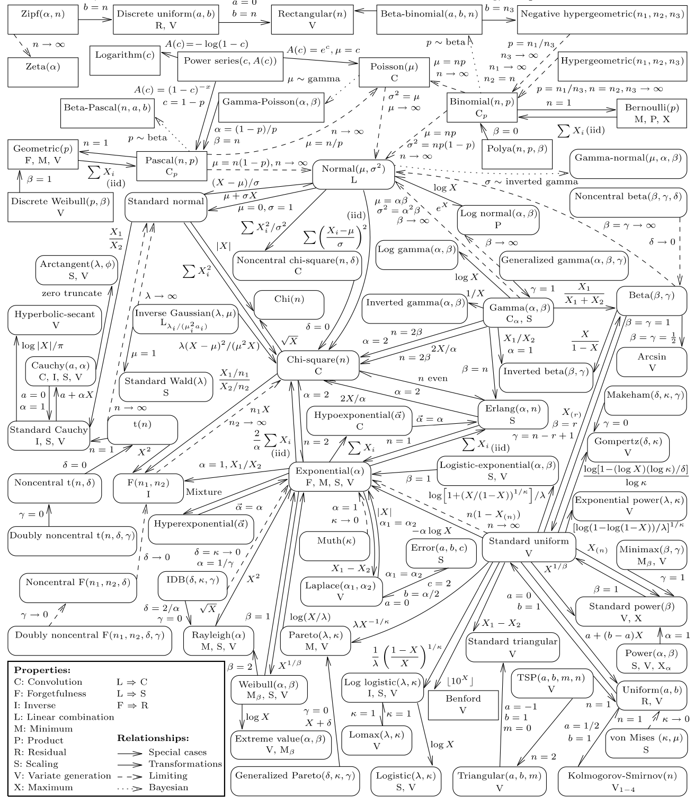
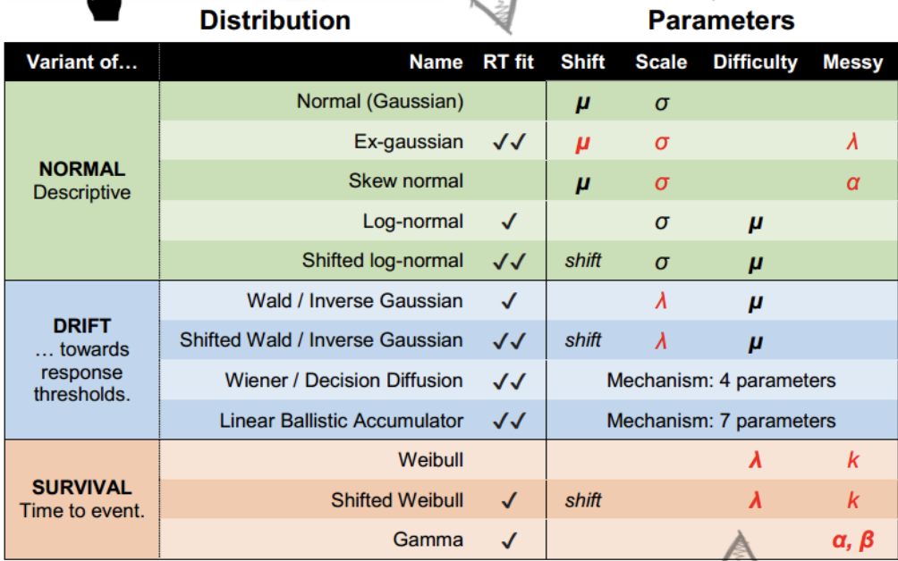

```{r setup, include=FALSE}
knitr::opts_chunk$set(echo = TRUE)
```
```{r xaringan-themer, include = FALSE}
library(xaringanthemer)
mono_light(
  base_color = "#23395b",
  header_font_google = google_font("Josefin Sans"),
  text_font_google   = google_font("Montserrat", "300", "300i"),
  code_font_google   = google_font("Droid Mono"),
)

library(tidyverse)
library(broom)
```

<style type="text/css">
.remark-slide-content {
    font-size: 30px;
    padding: 1em 4em 1em 4em;
}

.small{ 
  font-size: 80%}
.tiny{
  font-size: 65%}
</style>


## This time: 

work with distributions other than gaussian/t

introduce glm familes with link functions


---
## Generalized linear model

used to describe different Data Generating Processes (DGPs) other than gausian normal

need to use if we cannot use the Gaussian normal e.g. the range of Y is restricted (e.g. binary, count) and/or the variance of Y depends on the mean

Need to 1. Specify your DGP distribution and 2. Specify a link function


---
## Binomial

$$y_i \sim \operatorname{Binomial} (n, p_i)$$

$$f(p_i) = \alpha + \beta (x_i - \bar x)$$
The f of the $f(p_i)$ is a link function. Typically we use a logistic link. 

Link function is need because the shape of the Binomial distribution is determined by two parameter, neither equivalent to the Gaussian mean. The link function also ensures the model doesn’t make improper probability predictions (ie outside of 0-1)

---
## Link function for binomial
Our number of trials is a fixed N, (here it is 1, a Bernoulli) so we are predicting the probability of y. Probabilities are bounded between 0 and 1 
 
Because our variables are not in probability units we need to "link" them via a function. The linear right side of the equation is not in the same units as the non-linear left side.  Instead of predicting probabilities directly, we are instead predicting the log of the odds. Other link functions: probit, negative inverse, cloglog. 

We need to map (0,1) to $(-\infty, \infty)$ Think of it as a transformation of Y-hats
$$f(p) = logit(p) = log (\frac {p_{i}}{1-p_{i}})$$

---
## Maximum Entropy
For an outcome variable that is continuous and far from any theoretical maximum or minimum, Gaussian model has maximum entropy. But when the outcome variable is either discrete or bounded, a Gaussian likelihood is not the most powerful choice. 

---
.pull-left[The distribution that can happen the greatest number of ways is the most plausible distribution. Call this distribution the maximum entropy distribution

Here it is the uniform
]

.pull-right[
```{r, echo = FALSE, warning = FALSE, message= FALSE}
library(tidyverse)
library(brms)
```


```{r, echo = FALSE, messages = FALSE}

d <-
  tibble(a = c(0, 0, 10, 0, 0),
         b = c(0, 1, 8, 1, 0),
         c = c(0, 2, 6, 2, 0),
         d = c(1, 2, 4, 2, 1),
         e = 2) 

d %>% 
  mutate(bucket = 1:5) %>% 
  gather(letter, pebbles, - bucket) %>% 
  
  ggplot(aes(x = bucket, y = pebbles)) +
  geom_col(width = 1/5) +
  geom_text(aes(y = pebbles + 1, label = pebbles)) +
  geom_text(data = tibble(
    letter  = letters[1:5],
    bucket  = 5.5,
    pebbles = 10,
    label   = str_c(c(1, 90, 1260, 37800, 113400), 
                    rep(c(" way", " ways"), times = c(1, 4)))),
    aes(label = label), hjust = 1) +
  scale_y_continuous(breaks = c(0, 5, 10))  +
  facet_wrap(~letter, ncol = 2)

```
]

---

If all we are willing to assume about a collection of measurements is that they have a finite variance, then the Gaussian distribution represents the most conservative probability distribution to assign to those measurements. With different assumptions, provided our assumptions are good ones, the principle of maximum entropy leads to distributions other than the Gaussian

Assumptions about your DGP should specify your likelihood function. NOT YOUR OBSERVED DISTRIBUTION OF DATA. 

There is a folk understanding about different types of data and the distributions used e.g., counts we use poisson. Usually this folk knowledge aligns with the principle of maximum entropy

---
## Exponential Family

```{r, echo = FALSE}
library(patchwork)

E1 <- ggplot(data.frame(x = c(0, 15)), aes(x = x))  +
    stat_function(fun = dexp, args = (mean=0.2), geom = "area", fill = "blue", alpha = 0.25) + ggtitle("Exponential with lambda = 0.2") 

G1 <- ggplot(data.frame(x = c(0, 5)), aes(x = x))  +
    stat_function(fun = dgamma, args=list(shape=2, rate=2), geom = "area", fill = "blue", alpha = 0.25) + ggtitle("Gamma with lambda = 2, kappa = 2") 

p1 <- tibble(x = 0:12) %>% 
  mutate(density = dpois(x, lambda = 3),
         strip   = "y %~% Poisson(lambda)") %>% 
  ggplot(aes(x = x, y = density)) +
  geom_col(fill = "blue", alpha = 0.25,width = 1/2) +
  ggtitle("Poisson with lambda = 3") 

b1 <-tibble(x = 0:10) %>% 
  mutate(density = dbinom(x, size = 10, prob = .3),
         strip   = "y %~% Binomial(n, p)") %>% 
  ggplot(aes(x = x, y = density)) +
  geom_col(fill = "blue", alpha = 0.25, width = 1/2) +
  ggtitle("binomial with N = 10, p = .3") 

(E1 + G1) /
  (p1 + b1)
```

---

Exponential is constrained to be above zero. If probability of some event is constant, it tends to follow an exponential. Used a lot in survival models. 

Gamma is positive but allowed to have a maximum that is not zero. This results when 2 or more exponential processes combine. 

Poisson for counts, when p is low and or number of trials is considered infinite. Special case of binomial. 

---

.tiny[


]

---
## brms families

gaussian, student, binomial, bernoulli, poisson, negbinomial, geometric, Gamma, skew_normal, lognormal, shifted_lognormal, exgaussian, wiener, inverse.gaussian, exponential, weibull, frechet, Beta, dirichlet, von_mises, asym_laplace, gen_extreme_value, categorical, multinomial, cumulative, cratio, sratio, acat, hurdle_poisson, hurdle_negbinomial, hurdle_gamma, hurdle_lognormal, zero_inflated_binomial, zero_inflated_beta, zero_inflated_negbinomial, zero_inflated_poisson, and zero_one_inflated_beta

---
## Common RT distributions
.small[

]

---
## Example

```{r, echo = FALSE, message = FALSE}
library(readr)
mortality <- read_csv("mortality.csv")
```

```{r}
mortality <- mortality %>% 
  mutate(IQ_c = IQ - mean(IQ))
mortality
```


---

$$P.Death_i  \sim \operatorname{Binomial} (1, p_i)$$   

$$\operatorname{logit} (p_i)= \beta_0 + \beta_1*IQ_c $$ 
$$\beta_0\sim \operatorname{Normal} (0, ?)$$
$$\beta_1\sim \operatorname{Normal} (0, ?)$$

---
```{r}
glm.1 <-
  brm(family = binomial,
      NOT.premature | trials(1) ~ 1,
      prior(normal(0, 10), class = Intercept),
      sample_prior = T,
      data = mortality,
      file = "glm.1")
```


---
.pull-left[
```{r}
prior_samples(glm.1) 
```
]


.pull-right[
```{r}
prior_samples(glm.1) %>% 
  mutate(p = inv_logit_scaled(Intercept)) %>% 
  ggplot(aes(x = p)) +
  geom_density( )
```

]

---

```{r}
glm.2 <-
  brm(family = binomial,
      NOT.premature | trials(1) ~ 1,
      prior(normal(0, 2), class = Intercept),
      sample_prior = T,
      data = mortality,
      file = "glm.2")
```


---

```{r}
prior_samples(glm.2) %>% 
  mutate(p = inv_logit_scaled(Intercept)) %>% 
  ggplot(aes(x = p)) +
  geom_density( )
```

---

```{r}
glm.3 <-
  brm(family = bernoulli(link = "logit"),
      NOT.premature ~ 1 + IQ_c,
      prior = c(prior(normal(0, 2), class = Intercept),
      prior(normal(0, 3), class = b)),
      sample_prior = T,
      data = mortality,
      file = "glm.3")
```


---

```{r}
prior_samples(glm.3) 

```


---
.pull-left[
```{r, eval = FALSE}
prior_samples(glm.3)%>% 
  sample_n(size = 100) %>% 
  rownames_to_column("draw") %>% 
  expand(nesting(draw, Intercept, b),
         a = c(-9, 9)) %>% 
  mutate(d = Intercept + b * a) %>% 
  ggplot(aes(x = a, y = d)) +
  geom_line(aes(group = draw), alpha = .4) +
  labs(x = "IQ",
       y = "logit(Not-premature dealth)") +
  coord_cartesian(ylim = c(0, 10)) +
  theme_bw() +
  theme(panel.grid = element_blank()) 
```
]

.pull-right[
```{r, echo = FALSE}
prior_samples(glm.3)%>% 
  sample_n(size = 100) %>% 
  rownames_to_column("draw") %>% 
  expand(nesting(draw, Intercept, b),
         a = c(-9, 9)) %>% 
  mutate(d = Intercept + b * a) %>% 
  ggplot(aes(x = a, y = d)) +
  geom_line(aes(group = draw), alpha = .4) +
  labs(x = "IQ",
       y = "logit(Not-premature dealth)") +
  coord_cartesian(ylim = c(0, 10)) +
  theme_bw() +
  theme(panel.grid = element_blank()) 
```
]

---
.pull-left[
scaled to probability
```{r, eval = FALSE}

a <- seq(-9,9, .2)

prior_samples(glm.3)%>% 
  sample_n(size = 100) %>% 
  rownames_to_column("draw") %>% 
  expand(nesting(draw, Intercept, b), a) %>% 
  mutate(d = inv_logit_scaled(Intercept + b * a)) %>% 
  ggplot(aes(x = a, y = d)) +
  geom_line(aes(group = draw), alpha = .4) +
  labs(x = "IQ",
       y = "prob(Not-premature dealth)") +
  coord_cartesian(ylim = c(0, 1))
```
]

.pull-right[
```{r, echo = FALSE}

a <- seq(-9,9, .2)

prior_samples(glm.3)%>% 
  sample_n(size = 100) %>% 
  rownames_to_column("draw") %>% 
  expand(nesting(draw, Intercept, b), a) %>% 
  mutate(d = inv_logit_scaled(Intercept + b * a)) %>% 
  ggplot(aes(x = a, y = d)) +
  geom_line(aes(group = draw), alpha = .4) +
  labs(x = "IQ",
       y = "prob(Not-premature dealth)") +
  coord_cartesian(ylim = c(0, 1))
```

]

---

```{r}
summary(glm.3)
```

---


```{r}
glm.4 <-
  brm(family = bernoulli(link = "logit"),
      NOT.premature ~ 1 + IQ_c,
      prior = c(prior(normal(0, 2), class = Intercept),
      prior(normal(0, .5), class = b)),
      sample_prior = T,
      data = mortality,
      file = "glm.4")
```


---

.pull-left[
```{r, eval = FALSE}

a <- seq(-9,9, .2)

prior_samples(glm.4)%>% 
  sample_n(size = 100) %>% 
  rownames_to_column("draw") %>% 
  expand(nesting(draw, Intercept, b), a) %>% 
  mutate(d = inv_logit_scaled(Intercept + b * a)) %>% 
  ggplot(aes(x = a, y = d)) +
  geom_line(aes(group = draw), alpha = .4) +
  labs(x = "IQ",
       y = "prob(Not-premature dealth)") +
  coord_cartesian(ylim = c(0, 1))
```
]


.pull-right[
```{r, echo = FALSE}

a <- seq(-9,9, .2)

prior_samples(glm.4)%>% 
  sample_n(size = 100) %>% 
  rownames_to_column("draw") %>% 
  expand(nesting(draw, Intercept, b), a) %>% 
  mutate(d = inv_logit_scaled(Intercept + b * a)) %>% 
  ggplot(aes(x = a, y = d)) +
  geom_line(aes(group = draw), alpha = .4) +
  labs(x = "IQ",
       y = "prob(Not-premature dealth)") +
  coord_cartesian(ylim = c(0, 1))
```

]

---

```{r}
summary(glm.4)
```

---

```{r}
tibble(b0     = 1.62,
       b1     = .08,
       IQ_c = c(-6,-2,0,2,6)) %>% 
  mutate(logit_mu = b0 + b1 * IQ_c ) %>%
  mutate(Not_premature   = 1 / (1 + exp(-logit_mu)))
```


---
```{r}
plot(glm.4)
```

---
```{r}
pp_check(glm.4)
```


---
.pull-left[
```{r, eval = FALSE, message= FALSE, warning=FALSE}
library(tidybayes)
library(modelr)

mortality %>%
  data_grid(IQ_c, .model = mortality) %>%
  add_fitted_draws(glm.4) %>%
  sample_draws(100) %>% 
    ggplot(aes(y = .value, x = IQ_c)) +
  geom_line(aes(y = .value, group = .draw),
            color = "grey50", size = 1/3, alpha = 2/3) +
  ylim(0,1) + geom_point(data = mortality, 
               aes(y = NOT.premature),
               alpha = .3)
```
]

.pull-right[
```{r, echo = FALSE, messages = FALSE, warnings = FALSE}
library(tidybayes)
library(modelr)

mortality %>%
  data_grid(IQ_c, .model = mortality) %>%
  add_fitted_draws(glm.4) %>%
  sample_draws(100) %>% 
    ggplot(aes(y = .value, x = IQ_c)) +
  geom_line(aes(y = .value, group = .draw),
            color = "grey50", size = 1/3, alpha = 2/3) +
  ylim(0,1) + geom_point(data = mortality, 
               aes(y = NOT.premature),
               alpha = .3)
```
]

---
## multinomial logistic regression
When you are predicting more than two groups (aka softmax regression aka categorical regression aka maximum entropy classifier)

Uses a multi-nomial distribution, which is a parent of the binomial distribution

Need to construct K - 1 linear models for K events, similar to constructing number of dummy variables

---
## Example from SR

```{r, message = FALSE}
library(rethinking)

# simulate career choices among 500 individuals
n      <- 500           # number of individuals
income <- c(1, 2, 5)    # expected income of each career
score  <- 0.5 * income  # scores for each career, based on income

# next line converts scores to probabilities
p <- softmax(score[1], score[2], score[3])

# now simulate choice
# outcome career holds event type values, not counts
career <- rep(NA, n)  # empty vector of choices for each individual

# sample chosen career for each individual
set.seed(34302)
# sample chosen career for each individual
for(i in 1:n) career[i] <- sample(1:3, size = 1, prob = p)

d <-
  tibble(career = career) %>% 
  mutate(career_income = ifelse(career == 3, 5, career))

d %>%
  ggplot(aes(x = career)) +
  geom_bar(size = 0)

```


---


---
```{r, eval=FALSE}
fit1 <-
  brm( family = categorical(link = logit),
      Y ~ 0 + intercept + X1 + X2,
      prior(normal(0, 20), class = b),
      iter = 2000, warmup = 1000, cores = 4, chains = 4,
      data=data)
```


---
## Ordinal regression models

https://journals.sagepub.com/doi/pdf/10.1177/2515245918823199

---

test test

