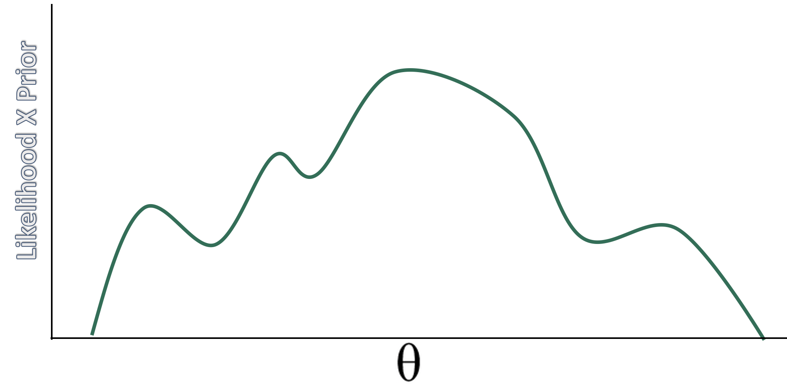
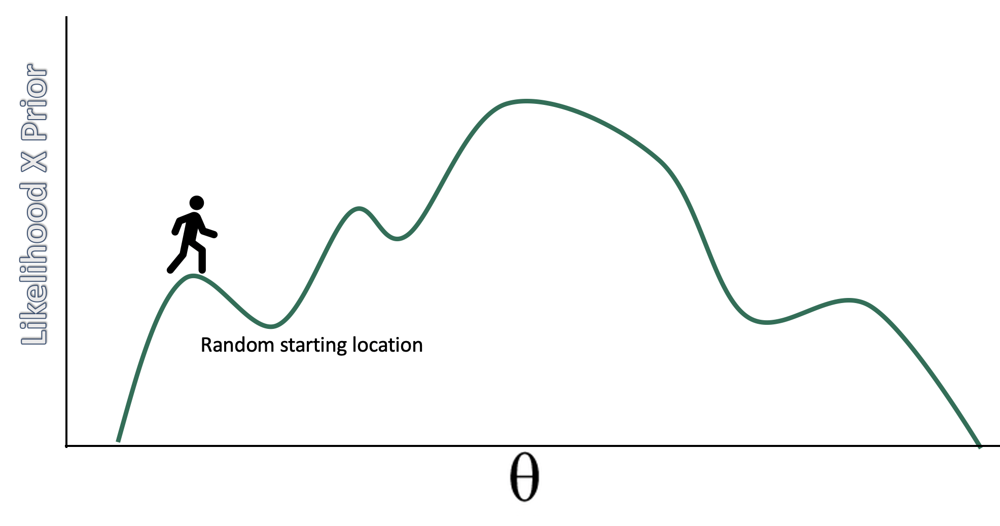
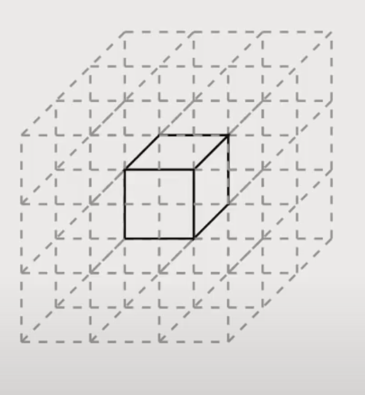

```{r setup, include=FALSE}
knitr::opts_chunk$set(echo = TRUE)
```

```{r xaringan-themer, include = FALSE}
library(xaringanthemer)
mono_light(
  base_color = "#23395b",
  header_font_google = google_font("Josefin Sans"),
  text_font_google   = google_font("Montserrat", "300", "300i"),
  code_font_google   = google_font("Droid Mono"),
)

library(tidyverse)
library(broom)
```


<style type="text/css">
.remark-slide-content {
    font-size: 30px;
    padding: 1em 4em 1em 4em;
}

.small .remark-code { 
  font-size: 80% !important;
}
.tiny .remark-code {
  font-size: 65% !important;
}
</style>


## How do we estimate the posterior? 

Grid, normal (quadratic) approximations, analytic/conjugate, MCMC, ABC

MCMC refers to a set of algorithms that sample from a probability distribution

Logic: if we don't know a distribution we draw samples from it. Instead of computations to directly specify the shape of the posterior, we get samples from this distribution and use these samples to describe the posterior. 

Think of marbles in the bag and "Bayesian inference is just counting example" -- we don't know what that looks like but we can sample from it to compute a posterior

---
## Why this way? 
Short answer: computation is difficult. 

Computation of the posterior requires three terms: a prior, a likelihood and the evidence. The evidence (aka probability of the data; marginal likelihood) normalizes the posterior so it integrates (adds up) to 1. 

We assume a prior distribution and we can compute a likelihood based on what we know about the distribution we assumed for the DGP (most of the time). The tricky part is the evidence. This makes computation analytically intractable.  

$$ p(x) = \int_\theta p(x|\theta)p(\theta)d(\theta) $$


---
### Conjugate priors

With many parameters it is basically impossible to compute analytically. "Bayesian analysis is hard because integrals are hard". Maximization (derivatives) is easier than integrals, which is why frequentist is so popular. 

Conjugate priors are a less computational heavy approach to solving the integral problem. If posterior is from the same family as prior then it is easier to compute the evidence. Eg. prior is normal, posterior is normal. For something like sigma, people use gamma and gamma. As a result the posterior, p( $\theta$ | data), becomes analytically tractable. 


---

$$p(\theta | data) \propto \frac{p(data | \theta) \times p(\theta )}{p(data)}$$

The evidence is a constant with respect to $\theta$ so the equation is often presented as: 

$$ p(\theta | data) \propto p(data | \theta) \times p(\theta ) $$
As Long as we can calculate the right side of the equation we can then sample from the posterior distribution

---
## Markov Chain Monte Carlo

Markov Chain: random process that undergoes transitions between states where the current state depends on the previous state. This is considered "memory less" because any state more than 1 away from each other is unrelated. 

Monte Carlo: Famous casino in Monaco. Used here to refer to repeated random sampling, like tossing dice

In the limit, the samples generated by the MCMC method will be samples from the target (posterior in our case) distribution. Note that the shape of the posterior does not have to be defined by a known probability distribution -- it can take any shape. 


---
## MCMC

Refers to a series of different algorithms. Metropolis, Gibbs, Hamiltonian are the most popular and historically relevant. 

Stan uses Hamiltonian
JAGS (in DBDA) stands for Just Another Gibbs Sampler
BUGS (Bayesian inference Using Gibbs Sampling) was recently popular

---
## Metropolis

.pull-left[
Played a role in developing the thermonuclear bomb with one of the earliest computers. Published in 1953 but ignored within stats b/c it was published within a physics/chemistry journal. Took about until 1990 for desktop computers to run fast enough to do at home. 
]

.pull-right[
Steps of algorithm: 
1. Sample a value of $ \theta $ 
2. Propose a new value centered on old + noise N(0, $\sigma$ )
3. Calculate likelihood*prior of proposal
4. Divide proposal value by current value
5. Sample from runif(1)
6. If proposal is greater, move. If not, stay. 

]


---




---



---


---


---


---
## samples in the long run...

.pull-left[
...will approximate the posterior distribution. The resulting chain will have the correct density in proportion to the posterior distribution. ]

.pull-right[

```{r, echo = FALSE}
num <- 1000
positions <- rep(0, num) 
current   <- 10

for (i in 1:num) {
  
  # record current position 
  positions[i] <- current
  # flip coin to generate proposal
  proposal <- current + sample(c(-1, 1), size = 1)
  # now make sure he loops around the archipelago 
  if (proposal < 1) proposal <- 10
  if (proposal > 10) proposal <- 1
  # move?
  prob_move <- proposal/current
  current <- ifelse(runif(1) < prob_move, proposal, current)
  
}  

library(tidyverse)

tibble(week   = 1:1000,
       iteration = positions) %>%
  ggplot(aes(x = week, y = iteration)) +
  geom_point(shape = 1) +
  scale_x_continuous(breaks = seq(from = 0, to = 1000, by = 100)) +
  scale_y_continuous(limits = c(-2, 13), breaks = seq(from = -2, to = 15, by = 2)) +
  coord_cartesian(xlim = c(0, 1000)) +
  labs(title = "Metropolis algorithm")+
  xlab("iteration") + ylab("value")


```
]

---

```{r, echo = FALSE}
tibble(week   = 1:1000,
       iteration = positions) %>%
  ggplot(aes(x= iteration)) +
  geom_density() +
  scale_x_continuous(breaks = seq(from = -0, to = 10, by = 1)) 


```

---
## Multivariate posterior distributions

.pull-left[Posteriors are not simple hill climbing exercises, instead they represent high dimensional spaces. These high dimensional spaces make it such that there is a lot of space to explore. 

To visualize posteriors we usually "marginalize" them, that is, visualize them averaged across other posteriors. ]


.pull-right[
```{r, echo = FALSE}
data <- "https://raw.githubusercontent.com/josh-jackson/bayes/master/week3.csv"

data <- read.csv(data) %>% 
  select(-ID, -SES)

library(ggExtra)

p <- ggplot(data, aes(x=friends, y=health)) +
      geom_point() +
      theme(legend.position="none")

p2 <- ggMarginal(p, type="density")
p2
```

]


---
## Gibbs

To explore a high dimensional space we need to be savvy about our proposals. Especially, when we are drawing samples for each parameter given a specific value of another parameter

Like metropolis, Gibbs "guesses and checks," but has more adaptive proposals so as to not explore so much space, leading to more efficient sampling because of conjugate priors.

Faster than Metropolis (and really probably good enough for most linear regressions) 

---
- But, but this efficient sampling can go awry and result in slow sampling, regardless of step size. If step size is too low, it takes a lot of samples to explore the space. If too large, there are too many rejections. 

```{r, echo = FALSE, message = FALSE}
samples = 200
r = 0.93

library('MASS')
cor.dat = mvrnorm(n=samples, mu=c(0, 0), Sigma=matrix(c(1, r, r, 1), nrow=2), empirical=TRUE)
X = cor.dat[, 1]  # standard normal (mu=0, sd=1)
Y = cor.dat[, 2]  # standard normal (mu=0, sd=1)

cor <- tibble(X,Y)

cor %>% 
  ggplot(aes(x = X, y = Y, fill = stat(density))) +
  stat_density_2d(geom = "raster", contour = F) +
  scale_fill_viridis_c(option = "D") +
  labs(x = expression(theta[1]),
       y = expression(theta[2])) +
  coord_equal() 

```

---
## A website to visualize the sampling process

https://chi-feng.github.io/mcmc-demo/app.html


---
## Concentration of measure
.pull-left[We need to be optimal with our samples. Will need a different approach than guess and check. 

Cannot just focus on the mode, we need to focus on the volume. The volume is an important part of the integral we are trying to solve with MCMC. Most of the volume in away from the mode. 
]

.pull-right[

]

---
.pull-left[

]


.pull-right[

]

---
## Hamiltonian


---
## Can we ensure accurate posteriors? 

Two key points: 

1. It is iterative, does not create the posterior distribution, instead it results in samples. 

2. It is stochastic. This means you wont get the same result each time. 

So we need to make sure that the algorithm "works" in that there are enough samples to get a good picture of the posterior, and that the samples will replicate across different attempts. 

---
## How many chains do you need?

- More iterations = more accurate posterior estimates

- ESS: 


---
## Checking convergence

- Convergence is to a target distribution (the required posterior), not to a single value as in ML methods

- 

---
## R-hat

---
## Trace plots

---
## Dealing with divergent transitions


---
## 