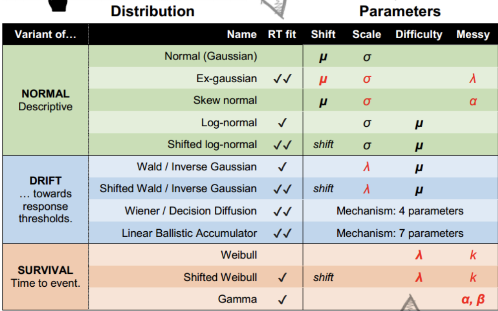

```{r setup, include=FALSE}
knitr::opts_chunk$set(echo = TRUE)
```
```{r xaringan-themer, include = FALSE}
library(xaringanthemer)
mono_light(
  base_color = "#23395b",
  header_font_google = google_font("Josefin Sans"),
  text_font_google   = google_font("Montserrat", "300", "300i"),
  code_font_google   = google_font("Droid Mono"),
)

library(tidyverse)
library(broom)
library(tidybayes)
library(modelr)
```

<style type="text/css">
.remark-slide-content {
    font-size: 30px;
    padding: 1em 4em 1em 4em;
}

.small{ 
  font-size: 80%}
.tiny{
  font-size: 65%}
</style>


## This time: 

work with distributions other than gaussian/t

introduce glm familes with link functions


---
## Generalized linear model

used to describe different Data Generating Processes (DGPs) other than gausian normal

need to use if we cannot use the Gaussian normal e.g. the range of Y is restricted (e.g. binary, count) and/or the variance of Y depends on the mean

Need to 1. Specify your DGP distribution and 2. Specify a link function


---
## Binomial

$$y_i \sim \operatorname{Binomial} (n, p_i)$$

$$f(p_i) = \alpha + \beta (x_i - \bar x)$$
The f of the $f(p_i)$ is a link function. Typically we use a logistic link. 

Link function is need because the shape of the Binomial distribution is determined by two parameter, neither equivalent to the Gaussian mean. The link function also ensures the model doesn’t make improper probability predictions (ie outside of 0-1)

---
## Link function for binomial
Our number of trials is a fixed N, (here it is 1, a Bernoulli) so we are predicting the probability of y. Probabilities are bounded between 0 and 1 
 
Because our variables are not in probability units we need to "link" them via a function. The linear right side of the equation is not in the same units as the non-linear left side.  Instead of predicting probabilities directly, we are instead predicting the log of the odds. Other link functions: probit, negative inverse, cloglog. 

We need to map (0,1) to $(-\infty, \infty)$ Think of it as a transformation of Y-hats
$$f(p) = logit(p) = log (\frac {p_{i}}{1-p_{i}})$$

---
## Maximum Entropy
For an outcome variable that is continuous and far from any theoretical maximum or minimum, Gaussian model has maximum entropy. But when the outcome variable is either discrete or bounded, a Gaussian likelihood is not the most powerful choice. 

---
.pull-left[The distribution that can happen the greatest number of ways is the most plausible distribution. Call this distribution the maximum entropy distribution

Here it is the uniform
]

.pull-right[
```{r, echo = FALSE, warning = FALSE, message= FALSE}
library(tidyverse)
library(brms)
```


```{r, echo = FALSE, messages = FALSE}

d <-
  tibble(a = c(0, 0, 10, 0, 0),
         b = c(0, 1, 8, 1, 0),
         c = c(0, 2, 6, 2, 0),
         d = c(1, 2, 4, 2, 1),
         e = 2) 

d %>% 
  mutate(bucket = 1:5) %>% 
  gather(letter, pebbles, - bucket) %>% 
  
  ggplot(aes(x = bucket, y = pebbles)) +
  geom_col(width = 1/5) +
  geom_text(aes(y = pebbles + 1, label = pebbles)) +
  geom_text(data = tibble(
    letter  = letters[1:5],
    bucket  = 5.5,
    pebbles = 10,
    label   = str_c(c(1, 90, 1260, 37800, 113400), 
                    rep(c(" way", " ways"), times = c(1, 4)))),
    aes(label = label), hjust = 1) +
  scale_y_continuous(breaks = c(0, 5, 10))  +
  facet_wrap(~letter, ncol = 2)

```
]

---

If all we are willing to assume about a collection of measurements is that they have a finite variance, then the Gaussian distribution represents the most conservative probability distribution to assign to those measurements. With different assumptions, provided our assumptions are good ones, the principle of maximum entropy leads to distributions other than the Gaussian

Assumptions about your DGP should specify your likelihood function. NOT YOUR OBSERVED DISTRIBUTION OF DATA. 

There is a folk understanding about different types of data and the distributions used e.g., counts we use poisson. Usually this folk knowledge aligns with the principle of maximum entropy

---
## Exponential Family

```{r, echo = FALSE}
library(patchwork)

E1 <- ggplot(data.frame(x = c(0, 15)), aes(x = x))  +
    stat_function(fun = dexp, args = (mean=0.2), geom = "area", fill = "blue", alpha = 0.25) + ggtitle("Exponential with lambda = 0.2") 

G1 <- ggplot(data.frame(x = c(0, 5)), aes(x = x))  +
    stat_function(fun = dgamma, args=list(shape=2, rate=2), geom = "area", fill = "blue", alpha = 0.25) + ggtitle("Gamma with lambda = 2, kappa = 2") 

p1 <- tibble(x = 0:12) %>% 
  mutate(density = dpois(x, lambda = 3),
         strip   = "y %~% Poisson(lambda)") %>% 
  ggplot(aes(x = x, y = density)) +
  geom_col(fill = "blue", alpha = 0.25,width = 1/2) +
  ggtitle("Poisson with lambda = 3") 

b1 <-tibble(x = 0:10) %>% 
  mutate(density = dbinom(x, size = 10, prob = .3),
         strip   = "y %~% Binomial(n, p)") %>% 
  ggplot(aes(x = x, y = density)) +
  geom_col(fill = "blue", alpha = 0.25, width = 1/2) +
  ggtitle("binomial with N = 10, p = .3") 

(E1 + G1) /
  (p1 + b1)
```

---

Exponential is constrained to be above zero. If probability of some event is constant, it tends to follow an exponential. Used a lot in survival models. 

Gamma is positive but allowed to have a maximum that is not zero. This results when 2 or more exponential processes combine. 

Poisson for counts, when p is low and or number of trials is considered infinite. Special case of binomial. 

---

.small[


]

---
## brms families

gaussian, student, binomial, bernoulli, poisson, negbinomial, geometric, Gamma, skew_normal, lognormal, shifted_lognormal, exgaussian, wiener, inverse.gaussian, exponential, weibull, frechet, Beta, dirichlet, von_mises, asym_laplace, gen_extreme_value, categorical, multinomial, cumulative, cratio, sratio, acat, hurdle_poisson, hurdle_negbinomial, hurdle_gamma, hurdle_lognormal, zero_inflated_binomial, zero_inflated_beta, zero_inflated_negbinomial, zero_inflated_poisson, and zero_one_inflated_beta

---
## Common RT distributions
.small[



]

---
## Example

```{r, echo = FALSE, message = FALSE}
library(readr)
mortality <- read_csv("mortality.csv")
```

```{r}
mortality <- mortality %>% 
  mutate(IQ_c = IQ - mean(IQ))
mortality
```


---

$$P.Death_i  \sim \operatorname{Binomial} (1, p_i)$$   

$$\operatorname{logit} (p_i)= \beta_0 + \beta_1*IQ_c $$ 
$$\beta_0\sim \operatorname{Normal} (0, ?)$$
$$\beta_1\sim \operatorname{Normal} (0, ?)$$

---
```{r}
glm.1 <-
  brm(family = binomial,
      NOT.premature | trials(1) ~ 1,
      prior(normal(0, 10), class = Intercept),
      sample_prior = T,
      data = mortality,
      file = "glm.1")
```


---
.pull-left[
```{r}
prior_samples(glm.1) 
```
]


.pull-right[
```{r}
prior_samples(glm.1) %>% 
  mutate(p = inv_logit_scaled(Intercept)) %>% 
  ggplot(aes(x = p)) +
  geom_density( )
```

]

---

```{r}
glm.2 <-
  brm(family = binomial,
      NOT.premature | trials(1) ~ 1,
      prior(normal(0, 2), class = Intercept),
      sample_prior = T,
      data = mortality,
      file = "glm.2")
```


---

```{r}
prior_samples(glm.2) %>% 
  mutate(p = inv_logit_scaled(Intercept)) %>% 
  ggplot(aes(x = p)) +
  geom_density( )
```

---

```{r}
glm.3 <-
  brm(family = bernoulli(link = "logit"),
      NOT.premature ~ 1 + IQ_c,
      prior = c(prior(normal(0, 2), class = Intercept),
      prior(normal(0, 3), class = b)),
      sample_prior = T,
      data = mortality,
      file = "glm.3")
```


---

```{r}
prior_samples(glm.3) 

```


---
.pull-left[
```{r, eval = FALSE}
prior_samples(glm.3)%>% 
  sample_n(size = 100) %>% 
  rownames_to_column("draw") %>% 
  expand(nesting(draw, Intercept, b),
         a = c(-9, 9)) %>% 
  mutate(d = Intercept + b * a) %>% 
  ggplot(aes(x = a, y = d)) +
  geom_line(aes(group = draw), alpha = .4) +
  labs(x = "IQ",
       y = "logit(Not-premature dealth)") +
  coord_cartesian(ylim = c(0, 10)) +
  theme_bw() +
  theme(panel.grid = element_blank()) 
```
]

.pull-right[
```{r, echo = FALSE}
prior_samples(glm.3)%>% 
  sample_n(size = 100) %>% 
  rownames_to_column("draw") %>% 
  expand(nesting(draw, Intercept, b),
         a = c(-9, 9)) %>% 
  mutate(d = Intercept + b * a) %>% 
  ggplot(aes(x = a, y = d)) +
  geom_line(aes(group = draw), alpha = .4) +
  labs(x = "IQ",
       y = "logit(Not-premature dealth)") +
  coord_cartesian(ylim = c(0, 10)) +
  theme_bw() +
  theme(panel.grid = element_blank()) 
```
]

---
.pull-left[
scaled to probability
```{r, eval = FALSE}

a <- seq(-9,9, .2)

prior_samples(glm.3)%>% 
  sample_n(size = 100) %>% 
  rownames_to_column("draw") %>% 
  expand(nesting(draw, Intercept, b), a) %>% 
  mutate(d = inv_logit_scaled(Intercept + b * a)) %>% 
  ggplot(aes(x = a, y = d)) +
  geom_line(aes(group = draw), alpha = .4) +
  labs(x = "IQ",
       y = "prob(Not-premature dealth)") +
  coord_cartesian(ylim = c(0, 1))
```
]

.pull-right[
```{r, echo = FALSE}

a <- seq(-9,9, .2)

prior_samples(glm.3)%>% 
  sample_n(size = 100) %>% 
  rownames_to_column("draw") %>% 
  expand(nesting(draw, Intercept, b), a) %>% 
  mutate(d = inv_logit_scaled(Intercept + b * a)) %>% 
  ggplot(aes(x = a, y = d)) +
  geom_line(aes(group = draw), alpha = .4) +
  labs(x = "IQ",
       y = "prob(Not-premature dealth)") +
  coord_cartesian(ylim = c(0, 1))
```

]

---

```{r}
summary(glm.3)
```

---


```{r}
glm.4 <-
  brm(family = bernoulli(link = "logit"),
      NOT.premature ~ 1 + IQ_c,
      prior = c(prior(normal(0, 2), class = Intercept),
      prior(normal(0, .5), class = b)),
      sample_prior = T,
      data = mortality,
      file = "glm.4")
```


---

.pull-left[
```{r, eval = FALSE}

a <- seq(-9,9, .2)

prior_samples(glm.4)%>% 
  sample_n(size = 100) %>% 
  rownames_to_column("draw") %>% 
  expand(nesting(draw, Intercept, b), a) %>% 
  mutate(d = inv_logit_scaled(Intercept + b * a)) %>% 
  ggplot(aes(x = a, y = d)) +
  geom_line(aes(group = draw), alpha = .4) +
  labs(x = "IQ",
       y = "prob(Not-premature dealth)") +
  coord_cartesian(ylim = c(0, 1))
```
]


.pull-right[
```{r, echo = FALSE}

a <- seq(-9,9, .2)

prior_samples(glm.4)%>% 
  sample_n(size = 100) %>% 
  rownames_to_column("draw") %>% 
  expand(nesting(draw, Intercept, b), a) %>% 
  mutate(d = inv_logit_scaled(Intercept + b * a)) %>% 
  ggplot(aes(x = a, y = d)) +
  geom_line(aes(group = draw), alpha = .4) +
  labs(x = "IQ",
       y = "prob(Not-premature dealth)") +
  coord_cartesian(ylim = c(0, 1))
```

]

---

```{r}
summary(glm.4)
```

---

```{r}
tibble(b0     = 1.62,
       b1     = .08,
       IQ_c = c(-6,-2,0,2,6)) %>% 
  mutate(logit_mu = b0 + b1 * IQ_c ) %>%
  mutate(Not_premature   = 1 / (1 + exp(-logit_mu)))
```


---
```{r}
plot(glm.4)
```

---
```{r}
pp_check(glm.4)
```


---
.pull-left[
```{r, eval = FALSE, message= FALSE, warning=FALSE}
library(tidybayes)
library(modelr)

mortality %>%
  data_grid(IQ_c, .model = mortality) %>%
  add_fitted_draws(glm.4) %>%
  sample_draws(100) %>% 
    ggplot(aes(y = .value, x = IQ_c)) +
  geom_line(aes(y = .value, group = .draw),
            color = "grey50", size = 1/3, alpha = 2/3) +
  ylim(0,1) + geom_point(data = mortality, 
               aes(y = NOT.premature),
               alpha = .3)
```
]

.pull-right[
```{r, echo = FALSE, messages = FALSE, warnings = FALSE}
mortality %>%
  data_grid(IQ_c, .model = mortality) %>%
  add_fitted_draws(glm.4) %>%
  sample_draws(100) %>% 
    ggplot(aes(y = .value, x = IQ_c)) +
  geom_line(aes(y = .value, group = .draw),
            color = "grey50", size = 1/3, alpha = 2/3) +
  ylim(0,1) + geom_point(data = mortality, 
               aes(y = NOT.premature),
               alpha = .3)
```
]

---
## Multinomial logistic regression
When you are predicting more than two groups (aka softmax regression aka categorical regression aka maximum entropy classifier)

Uses a multi-nomial distribution, which is a parent of the binomial distribution. Like the binomial but with more events (think of the bucket tossing example where each bucket has its own p). 

Need to construct K - 1 linear models for K events, similar to constructing number of dummy variables

---
## Multinomial example from SR
Career choice predicted by salary
```{r, echo = FALSE, message = FALSE}
library(rethinking)

# simulate career choices among 500 individuals
n      <- 500           # number of individuals
income <- c(1, 2, 5)    # expected income of each career
score  <- 0.5 * income  # scores for each career, based on income

# next line converts scores to probabilities
p <- softmax(score[1], score[2], score[3])

# now simulate choice
# outcome career holds event type values, not counts
career <- rep(NA, n)  # empty vector of choices for each individual

# sample chosen career for each individual
set.seed(34302)
# sample chosen career for each individual
for(i in 1:n) career[i] <- sample(1:3, size = 1, prob = p)

d <-
  tibble(career = career) %>% 
  mutate(career_income = ifelse(career == 3, 5, career))

d %>%
  ggplot(aes(x = career)) +
  geom_bar(size = 0)

```

---

```{r}
d
```


---
```{r}
glm.5 <-
  brm(family = categorical(link = logit, refcat = 3),
      career ~ 1,
      prior = c(prior(normal(0, 1), class = Intercept, dpar = mu1),
                prior(normal(0, 1), class = Intercept, dpar = mu2)),
      iter = 2000, warmup = 1000, cores = 4, chains = 4,
      data = d, 
      file = "glm.5")
```

---

```{r}
summary(glm.5)
```


---

```{r}
glm.5 %>% 
spread_draws(b_mu1_Intercept, b_mu2_Intercept) %>% 
  mutate(b_mu3_Intercept = 0) %>% 
  mutate(p1 = exp(b_mu1_Intercept) / (exp(b_mu1_Intercept) + exp(b_mu2_Intercept) + exp(b_mu3_Intercept)),
         p2 = exp(b_mu2_Intercept) / (exp(b_mu1_Intercept) + exp(b_mu2_Intercept) + exp(b_mu3_Intercept)),
         p3 = exp(b_mu3_Intercept) / (exp(b_mu1_Intercept) + exp(b_mu2_Intercept) + exp(b_mu3_Intercept))) %>% 
  pivot_longer(p1:p3) %>% 
  group_by(name) %>% 
  mean_qi(value) %>% 
  mutate_if(is.double, round, digits = 2)
```

---

mu1_Intercept coefficnet is -2.01. What does that mean? 
```{r}

exp(-2.01)
```

---
```{r}
get_prior(data = d, 
          family = categorical(link = logit, refcat = 3), 
          career ~ 1 + career_income)
```


---
```{r}

glm.6 <-
  brm(family = categorical(link = logit, refcat = 3),
      career ~ 1 + career_income,
      prior = c(prior(normal(0, 1), class = Intercept, dpar = mu1),
                prior(normal(0, 1), class = Intercept, dpar = mu2),
                prior(normal(0, .5), class = b, dpar = mu1),
                prior(normal(0, .5), class = b, dpar = mu2)),
      iter = 2000, warmup = 1000, cores = 4, chains = 4,
      data = d, 
      file = "glm.6")

```

---
```{r}
summary(glm.6)
```

---
### Comparison with logistic
Only fit 1 and 3 categories. Note how we fit a categorical, which a binomial is a special case, and which bernoulli is an even more special case. 

```{r}
glm.7 <-
  brm(family = categorical(link = logit, refcat = 3),
      career ~ 1 + career_income,
      prior = c(prior(normal(0, 1), class = Intercept),
                prior(normal(0, .5), class = b)),
      iter = 2000, warmup = 1000, cores = 4, chains = 4,
      data = d %>% filter(career != 2), 
      file = "glm.7")
```


---
```{r}
summary(glm.7)
```

---

```{r}

tibble(b0     = 5.64,
       b1     = -2.00,
       career_income = c(1:5)) %>% 
  mutate(logit_mu = b0 + b1 * career_income ) %>%
  mutate(career   = 1 / (1 + exp(-logit_mu)))
```

---
```{r}
summary(glm.6)
```


---
```{r}

tibble(b0     = 7.77,
       b1     = -2.99,
       career_income = c(1:5)) %>% 
  mutate(logit_mu = b0 + b1 * career_income ) %>%
  mutate(career   = 1 / (1 + exp(-logit_mu)))
```


---
### Constraining the effect to be similar across models

```{r}
glm.8 <-
  brm(family = categorical(link = logit, refcat = 3),
      bf(career ~ 1,
         nlf(mu1 ~ a1 + b *career_income ),
         nlf(mu2 ~ a2 + b *career_income),
         a1 + a2 + b ~ 1),
      prior = c(prior(normal(0, 1), class = b, nlpar = a1),
                prior(normal(0, 1), class = b, nlpar = a2),
                prior(normal(0, 0.5), class = b, nlpar = b)),
      iter = 2000, warmup = 1000, cores = 4, chains = 4,
      data = d,
      file = "glm.8")

```


---
```{r}
summary(glm.8)
```

---

```{r}

tibble(b0     = 4.12,
       b1     = -1.81,
       career_income = c(1:5)) %>% 
  mutate(logit_mu = b0 + b1 * career_income ) %>%
  mutate(career   = 1 / (1 + exp(-logit_mu)))
```

---
## GLMs for Counts
Binomial, Poisson, multinomial categorical

Geometric -- number of trails until an event
Surivial models
Mixtures like beta-binomial or Negative Binomial (gamma Poisson)

---
## Zero-inflated models
Use when there are different causes for the same observation -- a mixture of DGPs. 

Lots of ways to get zero counts: 
Missed observation or the rate is low -- hard to distinguish. 

```{r}

prob_drink <- 0.2  # 20% of days
rate_work  <- 1    # average 1 manuscript per day

# sample one year of production
n <- 365

# simulate days monks drink
set.seed(365)
drink <- rbinom(n, 1, prob_drink)

# simulate manuscripts completed
y <- (1 - drink) * rpois(n, rate_work)

zips <-
  tibble(drink = factor(drink, levels = 1:0), 
         y     = y)
  
ggplot(data = zips, aes(x = y)) +
  geom_histogram(aes(fill = drink),
                 binwidth = 1, size = 1/10, color = "grey92") +
  scale_fill_manual(values = 1:2) +
  xlab("Manuscripts completed") +
  theme(legend.position = "none")
```


---
### ZIP Zero inflated poisson
p = the probability of drinking (vs working). If drinking we know no manuscripts are created. If working, manuscripts still may not be created. That rate is modeled through lambda as a poisson, and a bernulli with a p 
$$\operatorname{Pr} (0 | p, \lambda)  = \operatorname{Pr} (\text{drink} | p) + \operatorname{Pr} (\text{work} | p) \times \operatorname{Pr} (0 | \lambda)$$
                                   $$= p + (1 - p) \exp (- \lambda)$$
The probability of observing a zero is the probability that the monks didn’t drink OR the probability that the monks worked AND failed to finish anything

$$\operatorname{Pr} (y | y > 0, p, \lambda) = \operatorname{Pr} (\text{drink} | p) (0) + \operatorname{Pr} (\text{work} | p) \operatorname{Pr} (y | \lambda) = (1 - p) \frac {\lambda^y \exp (- \lambda)}{y!}$$
Since drinking monks never produce, the expression above is  the chance the monks both work (1-p), and finish y manuscripts

---

$$y_i  \sim \operatorname{ZIPoisson} (p_i, \lambda_i)$$
$$\operatorname{logit} (p_i)      = \alpha_p + \beta_p x_i$$
$$\log (\lambda_i)  = \alpha_\lambda + \beta_\lambda x_i$$
---

```{r}
glm.9 <- 
  brm(family = zero_inflated_poisson,
      y ~ 1,
      prior = c(prior(normal(-1.5, 1), class = Intercept),
                prior(beta(2, 6), class = zi)),  # the brms default is beta(1, 1)
      iter = 2000, warmup = 1000, chains = 4, cores = 4,
      data = zips,
      file = "glm.9")
```

```{r, echo = FALSE}
zip.priors <-
  c(prior(beta(1, 1), class = zi),
    prior(beta(2, 6), class = zi))
zip.priors %>% 
  parse_dist(prior) %>%
  ggplot(aes(y = prior, dist = .dist, args = .args, fill = prior)) +
  stat_dist_halfeye(.width = .95) +
  scale_x_continuous("zi", breaks = c(0, .5, 1)) +
  ylab(NULL) +
  theme(legend.position = "none")
```

---
Noe: When there are no predictors for zi, the brms default is to use the identity link. With predictors it will use logit, so you will have to use what you know about logits to correctly interpret. 
```{r}
summary(glm.9)
```


---
Adding predictors. Do not necessarily need to have the same predictors for each process. One can predict the excess zeros, the other can predict the counts. 
```{r, eval = FALSE}
glm.9 <- 
  brm(family = zero_inflated_poisson,
      y ~ 1 + b, 
      zi ~ 1 + c,
      prior = c(prior(normal(-1.5, 1), class = Intercept),
                prior(beta(2, 6), class = zi)),  # the brms default is beta(1, 1)
      iter = 2000, warmup = 1000, chains = 4, cores = 4,
      data = zips,
      file = "glm.9")
```

---

Hurdle models/zero augmented


---
## Ordinal regression models

likert scales
never, sometimes, often
no degree, hs degree, some college, college degree

discrete, defined order, distance between categories is unknown

common assumption is to treat differences as the same and model as continuous with guassian 
---
### log cumulative odds link

The cumulative probability of a value is the probability of that value or any smaller value. In the context of ordered categories, the cumulative probability of 3 is the sum of the probabilities of 3, 2, and 1

```{r}
library(rethinking)
data(Trolley)
trolley <- Trolley
```

```{r, echo = FALSE}
p2 <-
  trolley %>%
  count(response) %>%
  mutate(pr_k     = n / nrow(trolley),
         cum_pr_k = cumsum(pr_k)) %>% 
  ggplot(aes(x = response, y = cum_pr_k, 
             fill = response)) +
  geom_line() +
  geom_point(shape = 21, color = "grey92", 
             size = 2.5, stroke = 1) +
  scale_x_continuous(breaks = 1:7) +
  scale_y_continuous("cumulative proportion", 
                     breaks = c(0, .5, 1), limits = c(0, 1)) +
  theme(axis.ticks = element_blank(),
        axis.title.y = element_text(angle = 90),
        legend.position = "none")

p2
```


---

We will have intercepts for each response option, each on the log-cumulative-odds scale. They will be interpreted as the cumulative probability of each outcome.

 $\alpha_k$ is an “intercept” unique to each possible outcome value k. We estimating the probability of some response yi being equal or less than to some category. E.g., the cumulative probability of getting a 5? It is the proportion of values that are 5 or less.  

$$\log \frac{\operatorname{Pr}(y_i \leq k)}{1 - \operatorname{Pr}(y_i \leq k)} = \alpha_k$$

---

```{r}
logit <- function(x) log(x / (1 - x)) 
trolley %>%
  count(response) %>%
  mutate(pr_k     = n / nrow(trolley),
         cum_pr_k = cumsum(n / nrow(trolley))) %>% 
  mutate(alpha = logit(cum_pr_k) %>% round(digits = 2))
```

---

```{r, echo = FALSE}
p1 <-
  trolley %>% 
  ggplot(aes(x = response, fill = ..x..)) +
  geom_histogram(binwidth = 1/4, size = 0) +
  # scale_fill_gradient(low = "grey",
  #                     high = "black") +
  scale_x_continuous(breaks = 1:7) +
  theme(axis.ticks = element_blank(),
        axis.title.y = element_text(angle = 90),
        legend.position = "none")


p3 <-
  trolley %>%
  count(response) %>%
  mutate(cum_pr_k = cumsum(n / nrow(trolley))) %>% 
  filter(response < 7) %>% 
  ggplot(aes(x = response, y = logit(cum_pr_k), fill = response)) +
  geom_line() +
  geom_point(shape = 21, colour = "grey92", 
             size = 2.5, stroke = 1) +
  scale_x_continuous(breaks = 1:7, limits = c(1, 7)) +
  ylab("log-cumulative-odds") +
  theme(axis.ticks = element_blank(),
        axis.title.y = element_text(angle = 90), 
        legend.position = "none")

(p1 | p2 | p3) 

```

---

$$\text{response}_i  \sim \operatorname{Categorical} (\mathbf p) $$
$$\text{logit}(p_k)  = \alpha_k - \phi $$ 
$$\phi               = 0 $$
$$\alpha_k           \sim \operatorname{Normal}(0, 1.5)$$


Where $\phi$ is a stand in for regression terms. Right now it is an intercept only model. 
$\alpha_k$ are our k intercepts, make up for #categories minus 1. 


---

```{r}
glm.10 <- 
  brm(family = cumulative,
      response ~ 1,
      prior(normal(0, 1.5), class = Intercept),
      iter = 2000, warmup = 1000, cores = 4, chains = 4,
      data = trolley, 
      file = "glm.10")
```


---

```{r}
summary(glm.10)
```

---

```{r}
glm.10 %>% 
gather_draws(b_Intercept[cut]) %>% 
  mutate(.value = inv_logit_scaled(.value)) %>% 
  group_by(cut) %>% 
  summarise(mean = mean(.value),
            sd   = sd(.value),
            ll   = quantile(.value, probs = .025),
            ul   = quantile(.value, probs = .975))
```

---

Quicker way via brms functions to get it but note that the standard error isn't in the probability metric. 
```{r}
glm.10 %>% 
  fixef() %>% 
  inv_logit_scaled()
```

---
### adding predictors

$$ \text{response}_i  \sim \operatorname{Categorical} (\mathbf p) $$
$$ \text{logit}(p_k)      = \alpha_k - \phi_i $$
$$  \phi_i = \beta_1 \text{action}_i + \beta_2 \text{contact}_i + \beta_3 \text{intention}_i + \beta_4 (\text{action}_i \times \text{intention}_i) + \beta_5 (\text{contact}_i \times \text{intention}_i) $$
$$\alpha_k               \sim \operatorname{Normal}(0, 1.5) $$
$$\beta_1, ..., \beta_5  \sim \operatorname{Normal}(0, 0.5) $$

---

```{r}
glm.11 <- 
  brm(family = cumulative,
      response ~ 1 + action + contact + intention + intention:action + intention:contact,
      prior = c(prior(normal(0, 1.5), class = Intercept),
                prior(normal(0, 0.5), class = b)),
      iter = 2000, warmup = 1000, cores = 4, chains = 4,
      data = trolley,
      file = "glm.11")
```

---

```{r}
summary(glm.11)
```

---
```{r}
posterior_samples(glm.11) %>% 
  select(b_action:`b_contact:intention`) %>% 
  pivot_longer(everything()) %>% 
  ggplot(aes(x = value, y = name)) +
  geom_vline(xintercept = 0, alpha = 1/5, linetype = 3) +
  stat_gradientinterval(.width = .5, size = 1, point_size = 3/2, shape = 21) +
  scale_x_continuous("marginal posterior", breaks = -5:0 / 4) +
  coord_cartesian(xlim = c(-1.4, 0))
```

---
### Unequal variances

The parameter related to latent variances is called disc (short for discrimination). 

```{r}
glm.12 <- 
  brm(family = cumulative,
      bf(response ~ 1 + action + contact + intention + intention:action + intention:contact) +
      lf(disc ~ 0 + action + contact + intention + intention:action + intention:contact, cmc = FALSE),
      prior = c(prior(normal(0, 1.5), class = Intercept),
                prior(normal(0, 0.5), class = b)),
      iter = 2000, warmup = 1000, cores = 4, chains = 4,
      data = trolley,
      file = "glm.12")
```

---
```{r}
summary(glm.12)
```


---
## Adjacent category /category specific models

Do you want to assume similar effects of your predictors across the range of your DV? Or does the effect occur only as certain differences between the categories? 

For example, predicting educational attainment. Negative peer influences may have a large effect at graduating HS but little effect compared to whether or not someone goes to graduate school. 

---

```{r}
conditional_effects(glm.11, categorical =TRUE)
```


---
## Categorical predictors


