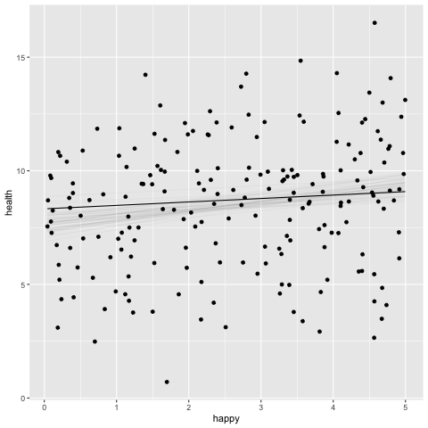

```{r setup, include=FALSE}
knitr::opts_chunk$set(echo = TRUE)
```
```{r xaringan-themer, include = FALSE}
library(xaringanthemer)
mono_light(
  base_color = "#23395b",
  header_font_google = google_font("Josefin Sans"),
  text_font_google   = google_font("Montserrat", "300", "300i"),
  code_font_google   = google_font("Droid Mono"),
)

library(tidyverse)
library(broom)
```

<style type="text/css">
.remark-slide-content {
    font-size: 30px;
    padding: 1em 4em 1em 4em;
}

.small .remark-code { 
  font-size: 80% !important;
}
.tiny .remark-code {
  font-size: 65% !important;
}
</style>


## Goals for this week
Go deeper into basic linear models to become comfortable with standard regressions

Again, we will walk through an example or two to help us along

---
## Example data
```{r, echo = FALSE}
library(tidyverse)
```


```{r}

data <- "https://raw.githubusercontent.com/josh-jackson/bayes/master/week3.csv"

week3 <- read.csv(data) %>% 
  select(-ID, -SES)

week3
```

---

```{r, echo = FALSE}
library(GGally)
ggpairs(week3)

```

---
## Model

Health ~ Normal( $\mu_i$ , $\sigma$ )  

$\mu_i$ = $\beta_0$ + $\beta_1$ $H_i$    

$\beta_0$ ~ Normal(0, 5)   
$\beta_1$ ~ Normal(0, 5) 
$\sigma$  ~ HalfCauchy(0,10) 

---
## Prior Predictive Distribution

```{r}

library(brms)

prior.1 <- prior(normal(0, 5), class = Intercept) +
                prior(normal(0, 5), class = b) +
                prior(cauchy(0, 10), class = sigma)


h.1p <- 
  brm(family = gaussian,
      health ~ 1 + happy,
      prior = prior.1,
      data = week3,
      sample_prior = "only",
      fit = "h.1p")

save(h.1p, file = "h.1p.rda")

```

---

.pull-left[
```{r, eval = FALSE}
library(tidybayes)
prior.1 %>% 
  parse_dist(prior) %>% 
  ggplot(aes(y=class, dist =.dist, args=.args)) +
  stat_dist_halfeye()+
  scale_x_continuous( limits = c(-50, 50))
```
]

.pull-right[
```{r, echo= FALSE, warning=FALSE}
library(tidybayes)
prior.1 %>% 
  parse_dist(prior) %>% 
  ggplot(aes(y=class, dist =.dist, args=.args)) +
  stat_dist_halfeye()+
  scale_x_continuous( limits = c(-50, 50))
```
]


---

.pull-left[
```{r, message = FALSE}
pp_check(h.1p) + xlim(-50,50)
```
]

.pull-right[
This graphs 10 simulated datasets from posterior predictive distribution, compared to the our actual density distribution  

How is this the posterior predictive distribution if we just sampled from the prior? We treat the priors as if they were the posteriors.  

]

---
```{r}
pp_check(h.1p,
         type = 'intervals')
```

---

```{r}
prior.2 <- prior(normal(0, 2), class = Intercept) +
                prior(normal(0, 2), class = b) +
                prior(cauchy(0, 1), class = sigma)
```


```{r}
h.2p <- 
  update(h.1p, prior = prior.2)
save(h.2p, file = "h.2p.rda")
```


---


```{r, echo= FALSE, warning=FALSE}
library(tidybayes)
prior.2 %>% 
  parse_dist(prior) %>% 
  ggplot(aes(y=class, dist =.dist, args=.args)) +
  stat_dist_halfeye()+
  scale_x_continuous( limits = c(-25, 25))

```


---
.pull-left[
```{r, evho=FALSE}
pp_check(h.2p) + xlim(-25,25)
```
]

.pull-right[
```{r, echo = FALSE}
pp_check(h.2p,
         type = 'intervals')
```
]


---
## Fit model

```{r}
h.1 <- 
  brm(family = gaussian,
      health ~ 1 + happy,
      prior = c(prior(normal(0, 5), class = Intercept),
                prior(normal(0, 5), class = b),
                prior(cauchy(0, 10), class = sigma)),
      data = week3)
```

---
## Summary
```{r}
summary(h.1, prob = .99)
```

---
```{r}
library(broom)
tidy(lm(health ~ happy, data = week3))
```

```{r}
glance(lm(health ~ happy, data = week3))
```

---
```{r}
plot(h.1)
```

---
### what are chains? 

Chains are the different sampling processes occurring simultaneously. The default is 4 chains, with 1000 samples from each chain, resulting in 40,000 samples of the posterior. 

Each chain is independent of other chains so as to ensure that the procedure can replicate 

---
## "The posterior is made of samples"

```{r}
post.h1 <- posterior_samples(h.1)
post.h1
```

---

tidybayes offers a similar function which will be helpful for more complex models
```{r}
p.h1 <- h.1 %>% 
spread_draws(b_Intercept, b_happy, sigma)
p.h1
```

---
```{r}
p.h1.long <- h.1 %>% 
gather_draws(b_Intercept, b_happy, sigma)
p.h1.long
```

---
samples are where we get our summary stats from

```{r}
p.h1.long %>% 
    mean_qi()
```

---

```{r, eval = FALSE}
p.h1.long %>% 
ggplot(aes(y = .variable, x = .value)) +
    stat_halfeye()
```


```{r, echo = FALSE}
p.h1.long %>% 
ggplot(aes(y = .variable, x = .value)) +
    stat_halfeye()
```

---
### samples imply multiple possible regression lines

```{r, echo = FALSE, eval = FALSE}
library(tidybayes)
library(modelr)
library(gganimate)

  p.lines <- week3 %>% 
  data_grid(happy = seq_range(happy, n = 101)) %>%
  add_fitted_draws(h.1, n = 50) %>%
  ggplot(aes(x = happy, y = health)) +
  geom_line(aes(y = .value, group = .draw)) +
  geom_point(data = week3) +
  scale_color_brewer(palette = "Dark2") +
  transition_states(.draw, 0, 1) +
  shadow_mark(future = TRUE, color = "gray50", alpha = 1/20) 
    
    animate(nframes = 50, fps = 2.5, width = 432, height = 288, res = 96, dev = "png", type = "cairo")

```





---
## Bayesian R2

```{r}
bayes_R2(h.1, summary = T) # use = FALSE to get samples of each R2
```
Typically it is the variance of the predicted values divided by total variance. 

But for Bayes we have 1) many predicted values (1 for each sample) and 2) we want to incorporate uncertainty in the estimates


---
A further issue is that you can get values over 1


---
## Rhat and other model components


---
## Categorical data


---
### dummy variables


---
## Factorial design


---
## Hypothesis function


---
## update function


---
## emmeans


---
## pp checks


---
## Robust regression
https://solomonkurz.netlify.app/post/robust-linear-regression-with-the-robust-student-s-t-distribution/

We are going to use a t-distribution as our likelihood. 

```{r, eval = FALSE}
b2 <- 
  brm(family = student,
      y ~ 1 + x,
      prior = c(prior(normal(0, 10), class = Intercept),
                prior(normal(0, 10), class = b),
                prior(gamma(4, 1), class = nu),
                prior(cauchy(0, 1),  class = sigma)),
      data = data)
```

---
### gamma plot


---
### fixing nu

```{r, eval = FALSE}
b4 <-
  brm(family = student,
      bf(y ~ 1 + x, nu = 4),
      prior = c(prior(normal(0, 100), class =Intercept),
                prior(normal(0, 10),  class = b),
                prior(cauchy(0, 1),   class = sigma)),
         data = o)
```


---
## Correlation preview

Introduce multivariate models


## For homework

Give model definition, ask to define likelihood, priors, etc. Then Ask how many parameters are in posterior distribution. 

Prior predictive simulations

visualizing different model effects


